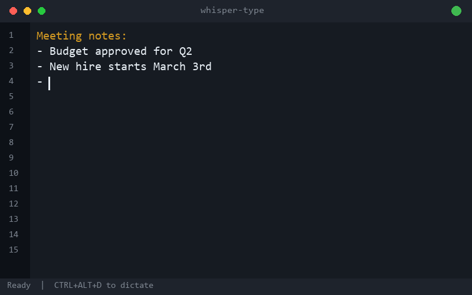

# Whisper Type

Local voice-to-text dictation for Windows. Press a hotkey, speak, text appears. Runs fully offline on your NVIDIA GPU with OpenAI's Whisper large-v3, delivering near-perfect accuracy for English, German, and 90+ other languages.

**[Download ZIP](https://github.com/TryoTrix/whisper-type/archive/refs/heads/master.zip)** | Requires Windows + NVIDIA GPU + Python 3.12+



## Features

- **Hotkey dictation:** Press `CTRL+ALT+D`, speak, press again, text gets pasted into the active window
- **Offline & private:** Everything runs locally on your GPU, no audio ever leaves your machine
- **Fast:** 73 seconds of speech transcribed in 7.7 seconds (9.5x real-time on RTX 4060)
- **Accurate:** CUDA float16 with beam search, handles dialects, background music, and long pauses
- **Multi-language:** Works with English, German, and all other Whisper-supported languages
- **Dashboard:** Click the tray icon to see today's stats, recent transcription history with click-to-copy, and quick actions (Calm Mode, restart, quit)
- **Electric Border recording overlay:** Animated microphone icon with dual-ring plasma effect (2D pixel displacement, breathing pulse, core flash), pre-rendered at 30fps. Red pulsing bar across all monitors
- **Calm Mode:** Toggle in the dashboard to replace the animated overlay with a simple static icon. Setting persists across restarts
- **Spoken punctuation:** Say "colon", "question mark" etc. and get the actual character (configurable)
- **Hallucination filter:** Known Whisper phantom outputs are detected and discarded
- **System tray:** Runs quietly in the background with a color-coded status icon (gray/green/red)
- **Audio feedback:** Beep tones on start/stop so you know when recording begins and ends
- **History log:** All transcriptions are saved with timestamps to `whisper-history.log`
- **Autostart:** Launches automatically on Windows login
- **Single file:** The entire tool is one Python script, easy to understand and customize

## Installation

### Prerequisites

- Windows 10/11
- Python 3.12+
- NVIDIA GPU with CUDA support (tested on RTX 4060)
- Up-to-date NVIDIA driver

### Setup

```
git clone https://github.com/TryoTrix/whisper-type.git
cd whisper-type
install.bat
```

The installer will:
1. Check for Python, pip, and NVIDIA GPU
2. Install all Python packages
3. Create an autostart shortcut
4. Download the Whisper model (~3 GB, one-time)
5. Start the dictation tool

## Usage

| Action | Shortcut |
|--------|----------|
| Start/stop recording | `CTRL+ALT+D` |
| Restart (if hook is lost) | `CTRL+ALT+W` |

**Tray icon colors:**

| Color | Status |
|-------|--------|
| Gray | Model loading (~4s) |
| Green | Ready |
| Red | Recording |

Left-click the tray icon to open the dashboard with stats, history, and actions. Right-click for the context menu.

### Tip: Mouse shortcut

With Razer Synapse (or similar software) you can map `CTRL+ALT+D` to a mouse button, e.g. Hypershift + scroll wheel click. Dictate without touching the keyboard.

## Spoken Punctuation

Say the word, the tool inserts the character. The default mapping uses German words but can be customized in the `SPOKEN_PUNCTUATION` dictionary at the top of `whisper-dictate.py`.

| Spoken word | Result |
|-------------|--------|
| Doppelpunkt | `: ` |
| Semikolon | `; ` |
| Ausrufezeichen | `!` |
| Fragezeichen | `?` |
| Gedankenstrich | ` - ` |
| Schrägstrich / Slash | `/` |
| Anführungszeichen | `"` |

## Configuration

All settings are defined as variables at the top of `whisper-dictate.py`:

| Variable | Description | Default |
|----------|-------------|---------|
| `MODEL_SIZE` | Whisper model | `large-v3` |
| `INITIAL_PROMPT` | Domain-specific terms for better recognition | Comma-separated list |
| `SPOKEN_PUNCTUATION` | Word-to-character mapping (regex) | See table above |
| `NO_SPEECH_THRESHOLD` | Silence detection threshold | `None` (disabled, VAD handles this) |
| `SHORT_TEXT_MAX_WORDS` | Remove trailing period for <= N words | `3` |
| `DEBUG_TRANSCRIPTION` | Write segment details to history log | `True` |

To switch the language, change the `language="de"` parameter in the `model.transcribe()` call to your language code (e.g. `"en"` for English).

## Speed & Accuracy

Uses Whisper `large-v3` with `float16` precision and `beam_size=5` for the best balance of quality and speed. Near-perfect accuracy for both English and German, including dialects and background music.

Benchmarks on RTX 4060:

| Scenario | Audio duration | Transcription time | Real-time factor |
|----------|----------------|-------------------|-----------------|
| Short dictation (1-3 words) | 2-4s | ~0.5s | 4-6x |
| Medium dictation (1-2 sentences) | 4-10s | ~1s | 5-10x |
| Long dictation (6 sentences) | ~55s | ~5s | 11x |
| Very long dictation (20 segments) | 73s | 7.7s | 9.5x |

If you prefer faster transcriptions over maximum accuracy, switch to `large-v3-turbo` with `beam_size=3` (~3-5x faster).

## How It Works

1. **Hotkey** triggers audio recording via `sounddevice`
2. **Audio** is captured as a NumPy array at 16kHz (no WAV file intermediary)
3. **Whisper** transcribes with `faster-whisper` (CTranslate2 backend) on your GPU
4. **Post-processing** applies spoken punctuation replacement and hallucination filtering
5. **Output** is pasted into the active window via clipboard

The recording overlay uses pre-rendered animation frames (90 frames, 30fps) with 2D pixel displacement simulating SVG feDisplacementMap. A dual-ring system (inner plasma ring + outer orbit ring) with independent noise fields creates the electric border effect. All blur layers are pre-composited before the frame loop for minimal CPU usage during recording.

## Platform Compatibility

| Platform | Status | Reason |
|----------|--------|--------|
| Windows 10/11 + NVIDIA GPU | Fully supported | Developed and tested |
| Linux + NVIDIA GPU | Not compatible | Uses Win32 APIs (kernel32, user32, winsound) |
| macOS (Intel/Apple Silicon) | Not compatible | No CUDA support, no Win32 APIs |

The Whisper engine itself (faster-whisper) runs cross-platform, but the integration layer (global hotkey, clipboard, overlay, system tray, audio feedback) is built on Windows APIs.

**Contributions welcome!** If you'd like to port Whisper Type to Linux or macOS, PRs are appreciated. The main components that need platform-specific replacements are:
- Global hotkey listener (`keyboard` library -> e.g. `pynput`)
- Clipboard paste (`pyperclip` + `keyboard.send("ctrl+v")` -> `xdotool`/`pbpaste`)
- System tray icon (`pystray` works cross-platform, minor adjustments needed)
- Recording overlay (tkinter with Win32 click-through -> platform-specific window flags)
- Audio feedback (`winsound.Beep` -> e.g. `simpleaudio`)
- GPU: Linux has CUDA support, macOS would need CoreML or CPU fallback

## System Requirements

| Component | Minimum | Recommended |
|-----------|---------|-------------|
| OS | Windows 10 | Windows 11 |
| GPU | NVIDIA with CUDA | RTX 3060+ |
| VRAM | 4 GB | 8 GB |
| Python | 3.12+ | 3.12+ |
| RAM | 8 GB | 16 GB |

## Author

Built by Daniel Gächter.

Check out my other projects:
- **[SEO Agent](https://seo-agent.ch)** - SEO services and web development in Switzerland
- **[Lotus Academy](https://nachhilfe-lotusacademy.ch)** - Tutoring school in German-speaking Switzerland

## License

MIT
