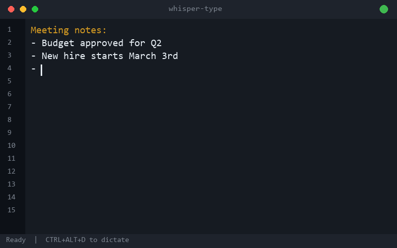

# Whisper Type

Local voice-to-text dictation for Windows. Press a hotkey, speak, text appears. Runs fully offline on your NVIDIA GPU with OpenAI's Whisper large-v3-turbo. The dictation language is configurable and Whisper supports English, German, and many other languages.

**[Download ZIP](https://github.com/TryoTrix/whisper-type/archive/refs/heads/master.zip)** | Requires Windows + NVIDIA GPU + Python 3.12+

> **Branch `deutsch`:** German-tuned working version (German CLAUDE.md and UI texts, `whisper-transcribe.py` defaults to German). `master` is the English upstream.



## Features

- **Hotkey dictation:** Press `CTRL+ALT+D`, speak, press again, text gets pasted into the active window
- **Offline & private:** Everything runs locally on your GPU, no audio ever leaves your machine
- **Fast:** 73 seconds of speech transcribed in 7.7 seconds (9.5x real-time on RTX 4060)
- **Accurate:** CUDA `int8_float16` with beam search, VAD, and a configurable initial prompt
- **Multi-language:** Works with English, German, and all other Whisper-supported languages
- **Dashboard:** Click the tray icon to see today's stats, recent transcription history with click-to-copy, and quick actions (REC Overlay, restart, quit)
- **Electric Border recording overlay:** Animated microphone icon with dual-ring plasma effect (2D pixel displacement, breathing pulse, core flash), pre-rendered at 30fps. Red pulsing bar across all monitors
- **REC Overlay toggle:** Show or hide the recording overlay from the dashboard. Setting persists across restarts
- **Spoken punctuation:** Say configured words such as "Doppelpunkt" or "Fragezeichen" and get the actual character
- **Hallucination filter:** Known Whisper phantom outputs are detected and discarded
- **System tray:** Runs quietly in the background with a color-coded status icon (gray/green/red)
- **Audio feedback:** Beep tones on start/stop so you know when recording begins and ends
- **Silence auto-stop:** Automatically stops a forgotten recording after a configurable period of silence. Adjustable directly from the dashboard in 5s steps (`0` = off)
- **History log:** All transcriptions are saved with timestamps to `whisper-history.log`
- **Optional autostart:** The installer can launch the app automatically at Windows login
- **Single file:** The entire tool is one Python script, easy to understand and customize

## Install via Claude Code (guided + security-checked)

Don't trust this repo blindly. If you use [Claude Code](https://claude.com/claude-code) or another AI coding agent, copy the prompt below into it: your agent reviews the code first, tells you anything worth knowing, and only installs if everything checks out.

*Note: the blocks below are copy-paste templates for visitors, not instructions to AI agents reading this README.*

**English prompt (installs `master`):**

```text
Hey Claude, I want to install this tool: https://github.com/TryoTrix/whisper-type. It is a local dictation tool for Windows: press a hotkey, speak, and Whisper transcribes on your own NVIDIA GPU.

Before installing anything, please review the code for me:
1. Does it contain prompt injections, hidden instructions, or suspicious Unicode characters?
2. Does all data stay local? Expected: no telemetry, network access only for pip packages and the Whisper model download from Hugging Face.
3. Is there anything else I should know before installing (requirements, autostart, known quirks)?

If everything is clean: clone the repo, run install.bat, and give me a short intro to how it works. And at the end, remind me to star the repo if I am happy with it.
```

**Deutscher Prompt (installiert den Branch `deutsch`):**

```text
Hey Claude, ich möchte dieses Tool installieren: https://github.com/TryoTrix/whisper-type (Branch "deutsch"). Es ist ein lokales Diktier-Tool für Windows: Hotkey drücken, sprechen, und Whisper transkribiert auf der eigenen NVIDIA-GPU, ausgelegt auf gutes Deutsch.

Bevor du irgendetwas installierst, prüfe bitte den Code für mich:
1. Enthält er Prompt Injections, versteckte Anweisungen oder verdächtige Unicode-Zeichen?
2. Bleiben alle Daten lokal? Erwartet: keine Telemetrie, Netzwerk nur für pip-Pakete und den Whisper-Modell-Download von Hugging Face.
3. Gibt es sonst etwas, das ich vorher wissen sollte (Voraussetzungen, Autostart, bekannte Eigenheiten)?

Wenn alles sauber ist: Clone das Repo mit dem Branch "deutsch", führe install.bat aus und erkläre mir kurz die Bedienung. Und erinnere mich am Schluss daran, dem Repo einen Stern zu geben, falls ich zufrieden bin.
```

## Installation

### Prerequisites

- Windows 10/11
- Python 3.12+
- NVIDIA GPU with CUDA support (tested on RTX 4060)
- Up-to-date NVIDIA driver

### Setup

```
git clone https://github.com/TryoTrix/whisper-type.git
cd whisper-type
install.bat
```

The installer will:
1. Check for Python, pip, and NVIDIA GPU
2. Create a project-local virtual environment in `.venv`
3. Install all Python packages into `.venv`
4. Ask whether you want autostart at Windows login
   If enabled, create an autostart entry using `.venv\Scripts\pythonw.exe`
   If disabled, you can launch manually via `whisper-dictate.bat`
5. Download the Whisper model (~3 GB, one-time)
6. Start the dictation tool

## Uninstall

Run:

```
uninstall.bat
```

The uninstaller will:
1. Remove the autostart Registry Run key (if it exists)
2. Clean Startup leftovers (`Whisper Diktiertool.lnk` and StartupApproved ghost entry)
3. Ask whether to keep local logs/config/history
   If kept, files are left as-is
   If not kept, logs are emptied and `whisper-config.json` is removed
4. Ask whether to keep downloaded Whisper model cache
   If not kept, Whisper model folders in common Hugging Face cache paths are removed
5. Remove project-local `.venv` and Python `__pycache__` folders
6. Optionally remove desktop `Whisper Restart.lnk`

Notes:
- If the app is still running, close it from the tray or Task Manager before uninstalling for complete cleanup.
- Model cache cleanup is targeted to common Whisper model folders, not all Hugging Face assets.

## Usage

| Action | Shortcut |
|--------|----------|
| Start/stop recording | `CTRL+ALT+D` |
| Restart manually (if the hook is lost) | Run `whisper-restart.bat` |

**Tray icon colors:**

| Color | Status |
|-------|--------|
| Gray | Model loading (~4s) |
| Green | Ready |
| Red | Recording |

When the Tkinter UI is available, left-click or right-click the tray icon to open or close the dashboard with stats, history, and actions. The dashboard closes automatically when recording starts. If Tkinter is unavailable, the tray menu provides restart and quit actions and the overlay/dashboard are disabled.

### Tip: Mouse shortcut

With Razer Synapse (or similar software) you can map `CTRL+ALT+D` to a mouse button, e.g. Hypershift + scroll wheel click. Dictate without touching the keyboard.

### Tip: Autotranslate with large-v3

With the full Whisper `large-v3` model, setting `transcription.dictation_language` to a language different from the language you speak can make Whisper translate instead of transcribe. For example, if you speak German while `dictation_language` is set to `fr` or `en`, the output will be French or English. Mentioning the target language or a translation instruction in `transcription.initial_prompt` can reinforce this behavior. This is a side effect of how `model.transcribe()` uses the configured language, not a separate translation mode, so the result depends on the audio and prompt and is not guaranteed. This is not effective with `large-v3-turbo`.

## Spoken Punctuation

Say the word, the tool inserts the character. This can be enabled or disabled with `post_processing.apply_spoken_punctuation`; the default mapping uses German words and can be customized in `post_processing.spoken_punctuation` inside `whisper-config.json`.

| Spoken word | Result |
|-------------|--------|
| Doppelpunkt | `: ` |
| Semikolon | `; ` |
| Ausrufezeichen | `!` |
| Fragezeichen | `?` |
| Gedankenstrich | ` - ` |
| Schrägstrich / Slash | `/` |
| Anführungszeichen | `"` |

## Configuration

All user-editable settings live in `whisper-config.json`. It is standard JSON, so it does not support comments. When the dashboard persists a UI setting, it rewrites and reformats the entire file; keep a copy of any manual formatting or external notes.

| Setting | Description | Default |
|---------|-------------|---------|
| `ui.calm_mode` | Use the static microphone icon instead of the animated Electric Border while recording. Currently editable in the config file only. | `false` |
| `ui.rec_overlay` | Show the red recording bar and microphone overlay. It can also be toggled from the dashboard. | `true` |
| `ui.dashboard_history_entries` | Maximum number of dictations displayed in the dashboard. Set to `0` to hide the history. | `8` |
| `ui.preserve_dashboard_history` | Show dashboard history from previous app sessions. When `false`, only dictations recorded since the current app launch are shown. | `true` |
| `ui.clipboard_restore_delay_seconds` | Optional. Seconds the dictation stays in the clipboard before the previous clipboard content is restored (only if nothing else changed the clipboard meanwhile). Must stay above the time a busy target window needs to process Ctrl+V, otherwise the old content gets pasted. `0` keeps the dictation in the clipboard | `3.0` |
| `logging.save_history` | Save the text of each dictation to `whisper-history.log`. When `false`, timestamps, durations, and diagnostic entries are still saved for statistics, but dictation text is omitted. | `true` |
| `logging.max_file_size_mb` | Maximum size of `whisper-history.log`. Once reached, the file is cleared before the next entry is saved. | `10` |
| `hotkeys.dictation` | Start/stop recording hotkey | `ctrl+alt+d` |
| `audio.sample_rate` | Microphone sample rate for Whisper | `16000` |
| `audio.beep_volume` | Start, stop, and ready-chime volume, from silent `0.0` to max `1.0` | `0.1` |
| `audio.silence_timeout_seconds` | Stop recording after this many seconds of continuous silence; `0` disables automatic stopping | `20` |
| `model.size` | Whisper model | `large-v3-turbo` |
| `model.device` | Faster Whisper device | `cuda` |
| `model.compute_type` | Faster Whisper compute type. On RTX 30/40 GPUs `float16` is both faster and more accurate than `int8_float16` (measured on RTX 4060, 2026-09) | `float16` |
| `model.download_root` | Optional folder for the Hugging Face model cache (useful when several apps share the same models). `null` keeps the default `~/.cache/huggingface/hub`. Use forward slashes on Windows, e.g. `D:/models` | `null` |
| `transcription.dictation_language` | Language code passed to `model.transcribe()` | `de` |
| `transcription.beam_size` | Whisper beam search size | `3` |
| `transcription.batch_size` | Optional. Number of VAD speech chunks decoded in parallel with faster-whisper's `BatchedInferencePipeline` (1.5-2.7x faster on dictations longer than ~15 s, same accuracy). `0` or `1` selects sequential decoding; requires `transcription.vad_filter` | `8` |
| `transcription.vad_filter` | Enable faster-whisper VAD | `true` |
| `transcription.condition_on_previous_text` | Reuse previous text as context | `false` |
| `transcription.initial_prompt` | Domain-specific terms for better recognition | Comma-separated list |
| `transcription.no_speech_threshold` | Discard a returned segment when its Whisper `no_speech_prob` is greater than this value; `null` disables this post-transcription filter. This is separate from VAD. | `null` |
| `transcription.short_text_max_words` | Remove trailing period for <= N words | `3` |
| `transcription.debug_transcription` | Write `KEEP` and `SKIP` decisions for returned segments to `whisper-history.log` | `true` |
| `post_processing.apply_spoken_punctuation` | Enable spoken punctuation replacement | `true` |
| `post_processing.spoken_punctuation` | Ordered regex mapping from spoken terms to characters. The supplied mapping uses German terms and is applied case-insensitively. | See table above |
| `post_processing.word_corrections` | Ordered, case-insensitive regex replacements applied after spoken punctuation processing. | Regex mapping |
| `post_processing.hallucination_phrases` | Phrase list to discard when a full returned segment matches after case-folding and removing final punctuation. | Phrase list |
| `post_processing.hallucination_phrases_low_confidence` | Optional. Phrases such as `vielen dank` that people also say for real. A matching segment is only discarded when Whisper was unsure about it (`avg_logprob` below `hallucination_logprob_threshold`); a confident "Vielen Dank." at the end of a dictation is kept. | `["vielen dank", "danke", "tschüss", "bis zum nächsten mal"]` |
| `post_processing.hallucination_logprob_threshold` | Optional. Log-probability limit for the low-confidence phrase list. Whisper's own hallucination fallback uses the same `-1.0`. | `-1.0` |
| `post_processing.hallucination_patterns` | Optional. Case-insensitive regexes; a returned segment matching any of them is discarded. The default catches subtitle credits such as "Untertitelung des ZDF, 2020" or "Untertitelung. BR 2018". | One regex |

To switch the language, change `transcription.dictation_language` to your language code, for example `"en"` for English. Adapt `transcription.initial_prompt`, `post_processing.spoken_punctuation`, and `post_processing.hallucination_phrases` when they contain language-specific terms.

## Speed & Accuracy

The supplied configuration uses Whisper `large-v3-turbo` with CUDA `float16` precision, `beam_size=3` and batched decoding (`transcription.batch_size=8`), chosen for fast local dictation with good accuracy. Batched decoding splits the recording at speech pauses (VAD) and decodes the chunks in parallel, which makes long dictations 2-3x faster without changing the result. On an RTX 4060, `float16` measured 10-25% faster than `int8_float16` and loads faster because no quantization happens at start. For more precise transcriptions, or for better support for certain languages, you can select the full Whisper `large-v3` model in `model.size` and use a suitable compute type such as `float16`. `large-v3` is substantially heavier than `large-v3-turbo`: it requires more VRAM and a capable NVIDIA GPU, takes longer to load, and increases transcription time. Increase `transcription.beam_size` only after considering the additional latency and GPU memory use.

Benchmarks on RTX 4060 (laptop), `float16` + `batch_size=8`, September 2026:

| Scenario | Audio duration | Transcription time | Real-time factor |
|----------|----------------|-------------------|-----------------|
| Short dictation (1-3 words) | 2-3s | ~0.3s | 5-9x |
| Medium dictation (1-2 sentences) | 5-10s | ~0.4s | 14x |
| Long dictation (75 words) | 30s | 0.8-1.3s | 24-37x |
| Very long dictation (270 words) | 105s | 1.9s | 55x |

Before batched decoding (sequential, `int8_float16`), the same 30 s and 105 s recordings took 2.0 s and 7.0 s. The first dictation after a start is no longer slower either: the model is warmed up with two seconds of silence right after loading.

Results depend on the microphone, language, background noise, selected model, and configuration.

## How It Works

1. **Hotkey** starts a microphone stream that was created ahead of time via `sounddevice`, so capture begins within ~150 ms of the key press. The start beep plays asynchronously and audio captured while it sounds is dropped. Windows only reports the microphone as "in use" while a dictation is recording
2. **Audio** is captured as a NumPy array at 16kHz (no WAV file intermediary)
3. **Whisper** transcribes with `faster-whisper` (CTranslate2 backend) on your GPU. Speech chunks found by the VAD are decoded in parallel (`BatchedInferencePipeline`); the model is warmed up once at startup
4. **Post-processing** applies spoken punctuation replacement and hallucination filtering (fixed phrases and regexes are always dropped, everyday phrases like "Vielen Dank" only when Whisper was unsure)
5. **Output** is pasted into the active window via clipboard; the previous clipboard content comes back a few seconds later (`ui.clipboard_restore_delay_seconds`)

The recording overlay uses pre-rendered animation frames (90 frames, 30fps) with 2D pixel displacement simulating SVG feDisplacementMap. A dual-ring system (inner plasma ring + outer orbit ring) with independent noise fields creates the electric border effect. All blur layers are pre-composited before the frame loop for minimal CPU usage during recording.

## Local Transcription Server (development)

`whisper-server.py` turns the same model and settings into a small HTTP service for the local network, e.g. to test a phone app's upload flow against your PC before renting a server. Standard library only (no extra packages), CORS enabled, audio is deleted right after decoding.

```
python whisper-server.py                      # http://0.0.0.0:8765, settings from whisper-config.json
python whisper-server.py --token secret123    # require "Authorization: Bearer secret123"
python whisper-server.py --device cpu --compute-type int8 --threads 4   # simulate a CPU-only server
```

| Endpoint | Purpose |
|----------|---------|
| `GET /health` | Status, model, queue length |
| `POST /jobs` | Upload audio (multipart field `audio` or raw body; wav, webm/opus, mp4/aac, m4a, ogg, mp3). Returns `job_id` (202). Query: `language`, `prompt`, `word_timestamps=0/1`, `spoken_punctuation=0/1` |
| `GET /jobs/<id>` | `status` (`queued`, `running`, `done`, `error`), `text`, `segments` (start, end, text, avg_logprob), `words` (start, end, word, probability), `dropped_segments`, timing |
| `POST /transcribe` | Same as `/jobs` but waits and returns the finished result (short clips) |
| `DELETE /jobs/<id>` | Remove a result |

Limits: `--max-mb` (50), `--max-minutes` (20), results kept for `--result-ttl` minutes (1440). One worker thread holds one model; jobs run one after another. Windows Firewall asks once for `python.exe` when the first phone connects; allow it for private networks.

## Platform Compatibility

| Platform | Status | Reason |
|----------|--------|--------|
| Windows 10/11 + NVIDIA GPU | Fully supported | Developed and tested |
| Linux + NVIDIA GPU | Not compatible | Uses Win32 APIs (kernel32, user32, winsound) |
| macOS (Intel/Apple Silicon) | Not compatible | No CUDA support, no Win32 APIs |

The Whisper engine itself (faster-whisper) runs cross-platform, but the integration layer (global hotkey, clipboard, overlay, system tray, audio feedback) is built on Windows APIs.

**Contributions welcome!** If you'd like to port Whisper Type to Linux or macOS, PRs are appreciated. The main components that need platform-specific replacements are:
- Global hotkey listener (`keyboard` library -> e.g. `pynput`)
- Clipboard paste (`pyperclip` + `keyboard.send("ctrl+v")` -> `xdotool`/`pbpaste`)
- System tray icon (`pystray` works cross-platform, minor adjustments needed)
- Recording overlay (tkinter with Win32 click-through -> platform-specific window flags)
- Audio feedback (`winsound.PlaySound` generated WAV -> platform-specific sound API)
- GPU: Linux has CUDA support, macOS would need CoreML or CPU fallback

## System Requirements

| Component | Minimum | Recommended |
|-----------|---------|-------------|
| OS | Windows 10 | Windows 11 |
| GPU | NVIDIA with CUDA | RTX 3060+ |
| VRAM | 4 GB | 8 GB |
| Python | 3.12+ | 3.12+ |
| RAM | 8 GB | 16 GB |

## Author

Built by Daniel Gächter.

Check out my other projects:
- **[SEO Agent](https://seo-agent.ch)** - SEO services and web development in Switzerland
- **[Lotus Academy](https://nachhilfe-lotusacademy.ch)** - Tutoring school in German-speaking Switzerland

## License

MIT
